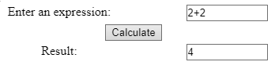

# JavaScript in one Markdown

## Contents:
### Review:
- Review
- Allocation
- Simple Examples
### JavaScript Language
- Values
- Data type conversion
- Variables
- Literals
- Expressions
- Operators
- Statements
- Functions
- Built-in Functions
- Objects
- Built-in Objects
- Event
### Built-in JavaScript Objects: Root (Root Properties
- Root Methods)
- Array (Array Description, Array Properties
- Array Methods)
- Boolean (Boolean Description)
- Data (Data Description, Data Methods)
- Function (Function Description)
- Image (Image Description
- Image Properties)
- Math (Math Description, Math Properties, Math Methods)
- Number (Number Description, Number Properties)
- String (String Description, String Properties, String Methods)

## Review
### Review
JavaScript is a compact, object-based scripting language for developing client and server Internet applications. Netscape Navigator interprets JavaScript statements embedded in an HTML page, and LiveWire enables you to create server-based applications similar to Common Gateway Interface (CGI) programs.

JavaScript is Netscape's cross-platform, object-based scripting language for client and server applications. There are two types of JavaScript:
- Navigator JavaScript, also called client-side JavaScript. 
- LiveWire JavaScript, also called server-side JavaScript.

JavaScript is a language. Client and server JavaScript differ in numerous ways, but they have the following elements in common:
- Keywords, statement syntax, and grammar
- Rules for expressions, variables, and literals
- Underlying object model (although Navigator and LiveWire have different object frameworks)
- Built-in objects and functions

### Allocation
```HTML
<html lang="en">

  <head>
    <title>... replace with your document's title ...</title>
    <meta http-equiv="Content-Type" content="text/html; charset=utf-8" />

    <script type="text/javascript" src="... insert link to file with your JavaScript code here ..."></script>

    <script type="text/javascript">
      //<!-- Begin to hide script contents from old browsers.
      ... or insert your JavaScript code here ...
      // End the hiding here. -->
    </script>

  </head>

  <body>
    ... replace with your document's content ...

    <script type="text/javascript">
      //<!-- Begin to hide script contents from old browsers.
      ... or insert your JavaScript code here ...
      // End the hiding here. -->
    </script>

    ... replace with your document's content ...

    <input type="button" value="Click Me" onClick="... or insert your JavaScript code here ..." />

    <a href="... any link or sharp ..." onBlur="... or insert your JavaScript code here ...">... replace with your text ...</a>

    ... replace with your document's content ...
  </body>

</html>
```

### JavaScript Simple Examples

####  1. Hello World!
##### Code:
```HTML
<html>
  <head></head>
  <body>
    <strong>Example:</strong>
    <script type="text/javascript">
      //<!-- 
      document.write("Hello World!");
      //-->
    </script>
    <div>All done.</div>
  </body>
</html>
```
##### Output:
```
Hello World!
All done.
```

#### 2. Defining and Dalling Functions
##### Code:
```HTML
<html>
  <head>
    <script type="text/javascript">
      //<!-- 
      function square(number) {
        return number * number;
      }
      //-->
    </script>
  </head>
  <body>
    <strong>Example:</strong>
    <script type="text/javascript">
      //<!-- 
      document.write("The function");
      document.write(" returned ");
      document.write(square(5), ".");
      //-->
    </script>
    <div>All done.</div>
  </body>
</html>
```
##### Output:
```The function returned 25.
All done.
```

#### 3. Using an Event Handler
##### Code:
```HTML
<html>
  <head>
    <script type="text/javascript">
      //<!-- 
      function compute(f) {
        if (confirm("Are you sure?"))
          f.result.value = eval(f.expr.value)
        else
          alert("Please come back again.")
      }
      //-->
    </script>
  </head>
  <body>
    <strong>Example:</strong>
    <form>
      Enter an expression:
      <input type="text" name="expr" size="10" value="2+2" /><br/>
      <input type="button" value="Calculate" onClick="compute(this.form)" /><br/>
      Result:
      <input type="text" name="result" size="10" /><br/>
    </form>
  </body>
</html>
```
##### Output:


## JavaScript Language
### Values
JavaScript recognizes the following types of values:
- Numbers, such as 42 or 3.14159
- Logical (Boolean) values, either true or false
- Strings, such as "Howdy!"
- null, a special keyword denoting a null value

### Data type conversion
JavaScript is a loosely typed language. That means you do not have to specify the data type of a variable when you declare it, and data types are converted automatically as needed during script execution. So, for example, you could define a variable as follows:

`var answer = 42`

And later, you could assign the same variable a string value, for example,

`answer = "Thanks for all the fish..."`

Because JavaScript is loosely typed, this assignment does not cause an error message.
In expressions involving numeric and string values, JavaScript converts the numeric values to strings. For example, consider the following statements:

```JavaScript
x = "The answer is " + 42
y = 42 + " is the answer."
```

The first statement returns the string "The answer is 42." The second statement returns the string "42 is the answer."

### Variables
You use variables as symbolic names for values in your application. You give variables names by which you refer to them and which must conform to certain rules.

A JavaScript identifier, or name, must start with a letter or underscore ("_"); subsequent characters can also be digits (0-9). Because JavaScript is case sensitive, letters include the characters "A" through "Z" (uppercase) and the characters "a" through "z" (lowercase).

Some examples of legal names are Number_hits, temp99, and _name.

You can declare a variable in two ways:

- By simply assigning it a value; for example, x = 42
- With the keyword var; for example, var x = 42

When you set a variable identifier by assignment outside of a function, it is called a global variable, because it is available everywhere in the current document. When you declare a variable within a function, it is called a local variable, because it is available only within the function. Using var is optional, but you need to use it if you want to declare a local variable inside a function that has already been declared as a global variable.

You can access global variables declared in one window or frame from another window or frame by specifying the window or frame name. For example, if a variable called phoneNumber is declared in a FRAMESET document, you can refer to this variable from a child frame as parent.phoneNumber.

### Literals
You use literals to represent values in JavaScript. These are fixed values, not variables, that you literally provide in your script.

#### Integers
Integers can be expressed in decimal (base 10), hexadecimal (base 16), and octal (base 8). A decimal integer literal consists of a sequence of digits without a leading 0 (zero). A leading 0 (zero) on an integer literal indicates it is in octal; a leading 0x (or 0X) indicates hexadecimal. Hexadecimal integers can include digits (0-9) and the letters a-f and A-F. Octal integers can include only the digits 0-7. Some examples of integer literals are: 42, 0xFFF, and -345.

#### Floating-point literals
A floating-point literal can have the following parts: a decimal integer, a decimal point ("."), a fraction (another decimal number), an exponent, and a type suffix. The exponent part is an "e" or "E" followed by an integer, which can be signed (preceded by "+" or "-"). A floating-point literal must have at least one digit, plus either a decimal point or "e" (or "E"). Some examples of floating-point literals are 3.1415, -3.1E12, .1e12, and 2E-12

#### Boolean literals
The Boolean type has two literal values: _true_ and _false_.

#### String literals
A string literal is zero or more characters enclosed in double (") or single (') quotation marks. A string must be delimited by quotation marks of the same type; that is, either both single quotation marks or double quotation marks.

The following are examples of string literals: "blah", 'blah', "1234", "one line \n another line".

In addition to ordinary characters, you can also include special characters in strings, as shown in the last element in the preceding list.

**Special Characters**

| Character |       Meaning       |
|-----------|---------------------|
| `\b`      |Backspace            |
| `\f`      |Form feed            |
| `\n`      |New line             |
| `\r`      |Carrige return       |
| `\t `     |Tab space            |
| `\\ `     |Backslash character  |

For characters not listed in the preceding table, a preceding backslash is ignored, with the exception of a quotation mark and the backslash character itself. You can insert quotation marks inside strings by preceding them with a backslash. This is known as escaping the quotation marks. For example,

```JavaScript
var quote = "He read \"The Cremation of Sam McGee\" by R.W. Service."
document.write(quote)
```

The result of this would be He read "The Cremation of Sam McGee" by R.W. Service. To include a literal backslash inside a string, you must escape the backslash character. For example, to assign the file path c:\temp to a string, use the following:

```JavaScript
var home = "c:\\temp"
```

### Expressions
An expression is any valid set of literals, variables, operators, and expressions that evaluates to a single value; the value can be a number, a string, or a logical value.

Conceptually, there are two types of expressions: those that assign a value to a variable, and those that simply have a value.

For example, the expression x = 7 is an expression that assigns x the value seven.

This expression itself evaluates to seven. Such expressions use assignment operators. On the other hand, the expression 3 + 4 simply evaluates to seven; it does not perform an assignment.

The operators used in such expressions are referred to simply as operators.

JavaScript has the following types of expressions:

- Arithmetic: evaluates to a number, for example 3.14159
- String: evaluates to a character string, for example, "Fred" or "234"
- Logical: evaluates to true or false

The special keyword null denotes a null value. In contrast, variables that have not been assigned a value are undefined and will cause a runtime error if used as numbers or as numeric variables.

Array elements that have not been assigned a value, however, evaluate to false. For example, the following code executes the function myFunction because the array element is not defined:

```JavaScript
myArray=new Array()
if (!myArray["notThere"])
myFunction()
```

A conditional expression can have one of two values based on a condition. The syntax is

`(condition) ? val1 : val2`

If condition is true, the expression has the value of val1. Otherwise it has the value of val2. You can use a conditional expression anywhere you would use a standard expression.

For example,

`status = (age >= 18) ? "adult" : "minor"`

This statement assigns the value "adult" to the variable status if age is eighteen or greater. Otherwise, it assigns the value "minor" to status.

### Operators
JavaScript has assignment, comparison, arithmetic, bitwise, logical, string, and special operators. This section describes the operators and contains information about operator precedence.

There are both binary and unary operators. A binary operator requires two operands, one before the operator and one after the operator:

`operand1 operator operand2`

For example, 3+4 or x*y.

A unary operator requires a single operand, either before or after the operator:

`operator operand`

or

`operand operator`

For example, x++ or ++x.

#### Assignment operators
An assignment operator assigns a value to its left operand based on the value of its right operand.

The basic assignment operator is equal (=), which assigns the value of its right operand to its left operand. That is, x = y assigns the value of y to x.

The other operators are shorthand for standard operations, as shown in the following table:

**Shorthand operators**

|  Shorthand operator  |     Meaning     |
|----------------------|-----------------|
|`x += y`              |	`x = x + y`  |
|`x -= y`              |	`x = x - y`  |
|`x *= y`              |	`x = x * y`  |
|`x /= y`              |	`x = x / y`  |
|`x %= y`              |	`x = x % y`  |
|`x <<= y`             |	`x = x << y` |
|`x >>= y`             |	`x = x >> y` |
|`x >>>= y`            |	`x = x >>> y`|
|`x &= y`              |	`x = x & y`  |
|`x ^= y`              |	`x = x ^ y`  |
|`x |= y`              |	`x = x | y`  |

####  Comparison operators
A comparison operator compares its operands and returns a logical value based on whether the comparison is true or not.

The operands can be numerical or string values. When used on string values, the comparisons are based on the standard lexicographical ordering.

They are described in the following table.

**Comparison operators**

|Operator | Name | Description | Example | Example Descritpion|
|---------|------|------|------|------|
== | Equal | Returns true if the operands are equal | x == y | Returns true if x equals y.
!= | Not equal | Returns true if the operands are not equal. | x != y | Returns true if x is not equal to y.
> | Greater than | Returns true if left operand is greater than right operand. | x > y | Returns true if x is greater than y.
>= | Greater than or equal | Returns true if left operand is greater than or equal to right operand. | x >= y | Returns true if x is greater than or equal to y.
< | Less than | Returns true if left operand is less than right operand. | x < y | Returns true if x is less than y.
<= | Less than or equal | Returns true if left operand is less than or equal to right operand. | x <= y | Returns true if x is less than or equal to y.

#### Logical operators
Logical operators take Boolean (logical) values as operands and return a Boolean value. They are described in the following table.

Operator  |  Name  |  Usage  |  Description
---------|------|------|------
&&  |  and  |  expr1 && expr2  |  Returns true if both logical expressions expr1 and expr2 are true. Otherwise, returns false.
`||`  |  or  |  `expr1 || expr2`  |  Returns true if either logical expression expr1 or expr2 is true. If both are false, returns false.
!  |  not  |  !expr  |  If expr is true, returns false; if expr is false, returns true.

> ##### Notes

> `false && anything` is short-circuit evaluated to false.

> `true || anything` is short-circuit evaluated to true.

#### Arithmetic operators
Arithmetic operators take numerical values (either literals or variables) as their operands and return a single numerical value.
The standard arithmetic operators are addition (+), subtraction (-), multiplication (*), and division (/).

These operators work as they do in other programming languages.

Synopsis  |  Name  |  Description  |  Example  |  Example Description
--|--|--|--|--
var1 % var2  |  Modulus  |  Returns the first operand modulo the second operand, that is, var1 modulo var2, in the preceding statement, where var1 and var2 are variables. The modulo function is the floating-point remainder of dividing var1 by var2  |  13 % 5  |  Returns 3
var++  |  Increment  |  Increments (adds one to) its operand and returns a value. If used postfix, with operator after operand (for example, x++), then it returns the value before incrementing. If used prefix with operator before operand (for example, ++x), then it returns the value after incrementing.  |  y = x++  |  If x is three, then the statement y = x++ sets y to three and increments x to four.
++var  |  y=++x  |  If x is three, then the statement y = ++x increments x to four and sets y to four.
var--  |  Decrement  |  Decrements (subtracts one from) its operand and returns a value. If used postfix (for example, x--), then it returns the value before decrementing. If used prefix (for example, --x), then it returns the value after decrementing.  |  y = x--  |  If x is three, then the statement y = x-- sets y to three and decrements x to two.
--var  |  y=--x  |  If x is three, then the statement y = --x decrements x to two and sets y to two.
-var  |  Unary negation  |  The unary negation precedes its operand and negates it.  |  x = -x  |  Negates the value of x; that is, if x were three, it would become -3.

#### Bitwise operators
Bitwise operators treat their operands as a set of bits (zeros and ones), rather than as decimal, hexadecimal, or octal numbers.

For example, the decimal number nine has a binary representation of 1001. Bitwise operators perform their operations on such binary representations, but they return standard JavaScript numerical values.

Operator  |  Usage  |  Description  |  Example
--|--|--|--
Bitwise AND  |  a & b  |  Returns a one in each bit position if bits of both operands are ones.  |  15 & 9 yields 9 (1111 & 1001 = 1001)
Bitwise OR  |  a | b  |  Returns a one in a bit if bits of either operand is one.  |  15 | 9 yields 15 (1111 | 1001 = 1111)
Bitwise XOR  |  a ^ b  |  Returns a one in a bit position if bits of one but not both operands are one.  |  15 ^ 9 yields 6 (1111 ^ 1001 = 0110)
Bitwise NOT  |  ~ a  |  Flips the bits of its operand.  |   
Left shift  |  a << b  |  Shifts a in binary representation b bits to left, shifting in zeros from the right.  |  9<<2 yields thirty-six, because 1001 shifted two bits to the left becomes 100100, which is thirty-six.
Sign-propagating right shift  |  a >> b  |  Shifts a in binary representation b bits to right, discarding bits shifted off.  |  9>>2 yields two, because 1001 shifted two bits to the right becomes 10, which is two.
Zero-fill right shift  |  a >>> b  |  Shifts a in binary representation b bits to the right, discarding bits shifted off, and shifting in zeros from the left.  |  19>>>2 yields four, because 10011 shifted two bits to the right becomes 100, which is four. For non-negative numbers, zero-fill right shift and sign-propagating right shift yield the same result.

#### String operators
In addition to the comparison operators, which can be used on string values, the concatenation operator (+) concatenates two string values together, returning another string that is the union of the two operand strings. For example, "my " + "string" returns the string "my string".

The shorthand assignment operator += can also be used to concatenate strings. For example, if the variable mystring has the value "alpha," then the expression mystring += "bet" evaluates to "alphabet" and assigns this value to mystring.

#### Special operators


#### Operator Precedence

Operator  |  Examples
---|---
assignment  |  <code>+= -= *= /= %= <<= >>= >>>= &= ^= &#124;=</code>
conditional  |  <code>?:<code>
logical-or  |  <code> &#124;&#124; </code>
logical-and  |  <code>&&</code>
bitwise-or  |  <code>&#124;</code>
bitwise-xor  |  <code>^</code>
bitwise-and  |  <code>&</code>
equality  |  <code>== !=</code>
relational  |  <code>< <= > >=</code>
bitwise shift  |  <code><< >> >>></code>
addition/subtraction  |  <code>+ -</code>
multiply/divide  |  <code>* / %</code>
negation/increment  |  <code>! ~ - ++ -- typeof void</code>
call, member  |  <code>() [] .</code>